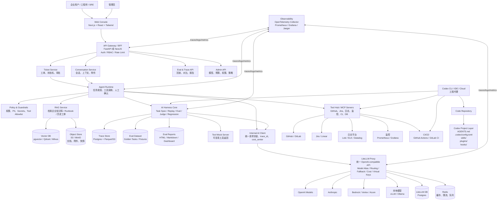
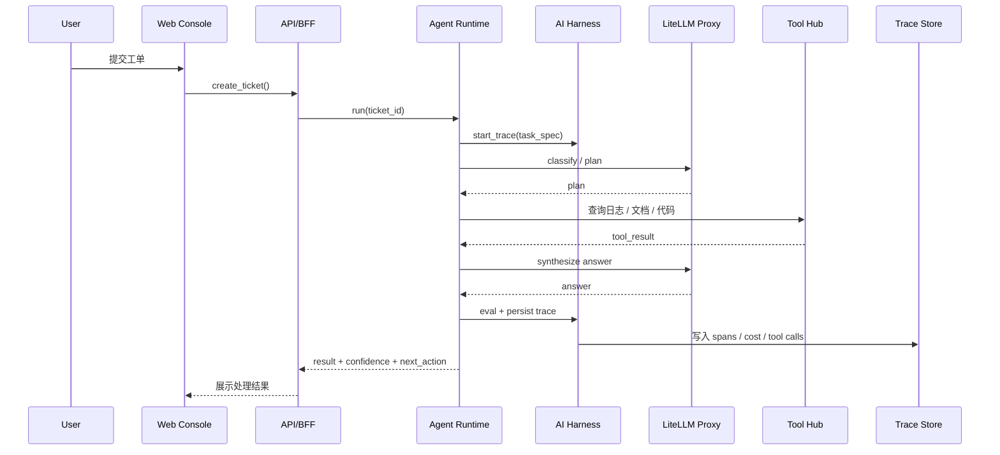

# 企业内部 AI 工单与故障处理平台架构设计

## 1. 项目定位

本项目以 **LiteLLM + Codex + AI Harness** 为基础，构建一个企业级 AI 工程平台案例：

> 企业员工或工程师提交问题后，系统自动分类、检索知识库、调用内部工具查询日志/监控/代码，生成处理建议；必要时由 Codex 辅助修改代码、运行测试并生成 PR。所有模型调用、工具调用和决策过程都由 Harness 记录、回放、评测和治理。

核心目标：

- LiteLLM 作为统一模型网关。
- Codex 作为工程自动化与代码修复入口。
- AI Harness 作为评测、回放、Trace、Mock、回归测试和治理中枢。
- 企业系统通过 MCP / Tool Service 受控接入。
- 平台具备权限、审计、预算、成本、CI Gate 和可观测性能力。

## 2. 总体架构图



## 3. 核心模块与技术选型

| 层级 | 作用 | 推荐技术 |
| --- | --- | --- |
| Web Console | 工单、对话、Trace、Eval、预算管理 | Next.js、React、TypeScript、Tailwind、shadcn/ui |
| API / BFF | 统一入口、鉴权、RBAC、租户隔离 | FastAPI 或 NestJS、JWT/OIDC、Casbin/Oso |
| Ticket Service | 工单状态机、审批、分派、SLA | FastAPI/NestJS、Postgres、Temporal 可选 |
| Conversation Service | 会话、上下文、附件、消息历史 | Postgres、Redis、S3/MinIO |
| Agent Runtime | 任务规划、工具调用、人工确认、状态管理 | Python 自研 Runtime、OpenAI Agents SDK、LangGraph 可选 |
| LiteLLM Gateway | 模型统一入口、路由、Fallback、成本、Virtual Keys | LiteLLM Proxy、Postgres、Redis |
| Internal AI Client | 统一封装模型请求、注入 trace/cost 元数据 | Python SDK、Pydantic、OpenTelemetry |
| AI Harness Core | 任务定义、回放、评测、Mock、回归比较 | Python CLI、Typer、Pytest、Pydantic、DuckDB |
| RAG Service | 企业知识库、Runbook、历史工单检索 | LlamaIndex/LangChain 可选、pgvector/Qdrant、OpenAI embeddings |
| Tool Hub / MCP | 受控工具调用、连接内部系统 | MCP Servers、FastAPI Tool Service |
| Codex 工程层 | 修代码、跑测试、生成 PR、调试失败 Trace | AGENTS.md、Codex Skills、Plugins、Hooks |
| Observability | 请求链路、模型调用、工具调用、成本、失败分析 | OpenTelemetry、Prometheus、Grafana、Jaeger/Langfuse |
| Data Layer | 工单、会话、Trace、Eval、配置 | Postgres、Redis、S3/MinIO、Parquet |

## 4. 模型调用链路



## 5. Codex 在系统中的位置

Codex 不建议直接作为生产 Agent Runtime。更推荐把 Codex 用作工程自动化入口：

- 根据失败 Eval 自动定位 prompt、tool、code 问题。
- 根据工单创建修复分支。
- 修改代码、运行测试、生成 PR 描述。
- 维护 Harness case、Golden Dataset、Mock Tools。
- 通过 Hooks 做 secrets 检查、测试门禁和规范检查。

推荐项目结构：

```text
repo/
  AGENTS.md
  .codex/
    config.toml
    hooks.json
  skills/
    run-evals/
    debug-trace/
    fix-ticket/
    release-ai-change/
  plugins/
    enterprise-ai-harness/
```

### Codex 相关职责

| 能力 | 放置位置 | 说明 |
| --- | --- | --- |
| 项目规则、测试命令、完成标准 | AGENTS.md | 让 Codex 理解项目约束 |
| Codex 默认模型、MCP、Hooks 配置 | .codex/config.toml | 项目级 Codex 配置 |
| 跑 Eval、调 Trace、修工单 | skills/ | 可复用工作流 |
| 企业内部能力分发 | plugins/ | 打包 skills、MCP、hooks、assets |
| 安全检查、测试门禁 | hooks | 在 Codex 生命周期内执行确定性脚本 |

## 6. Harness 设计

Harness 是本项目的核心工程资产，负责让 AI 行为可复现、可评测、可治理。

### 6.1 Harness CLI

```bash
ai-harness run tasks/incident-login-500.yaml --model smart
ai-harness replay traces/2026-07-04/*.json
ai-harness compare baseline:v12 candidate:v13
ai-harness report runs/2026-07-04
```

### 6.2 Task Spec 示例

```yaml
id: incident-login-500
type: incident_triage
input:
  ticket_title: "登录服务 500 错误增多"
  environment: "prod"
tools:
  allowed:
    - search_runbook
    - query_logs
    - query_metrics
    - search_code
limits:
  max_model_cost_usd: 0.30
  max_steps: 8
expected:
  must_include:
    - suspected_root_cause
    - evidence
    - rollback_or_fix_plan
eval:
  checks:
    - schema
    - tool_usage
    - factuality_judge
    - cost_limit
```

### 6.3 Harness 关键能力

| 能力 | 说明 |
| --- | --- |
| Task Spec | 用 YAML/JSON 定义任务输入、工具权限、限制和期望结果 |
| Trace Recording | 记录 prompt、response、tool calls、token、cost、latency、commit |
| Replay | 对历史任务使用新模型、新 prompt、新工具策略重跑 |
| Compare | 对比 baseline 和 candidate 的质量、成本、延迟、失败率 |
| Tool Mock | 固定工具返回，保证 Eval 可复现 |
| Judge | 使用 judge model、规则校验、schema 校验、业务断言混合评分 |
| CI Gate | 在 PR 阶段阻止 prompt/agent/tool 退化 |
| Report | 输出 HTML/Markdown/Dashboard 报告 |

## 7. LiteLLM 网关设计

LiteLLM 负责统一模型访问层，不让业务系统直接依赖具体模型供应商。

推荐模型别名：

```yaml
model_aliases:
  fast: gpt-4.1-mini 或同类低延迟模型
  smart: gpt-4.1 或更强推理模型
  judge: 专门用于评测打分的模型
  code: 适合代码理解和修复的模型
  cheap: 低成本批处理模型
  local: 本地 vLLM/Ollama 模型
```

LiteLLM 重点能力：

- OpenAI-compatible API。
- 多模型供应商统一调用。
- Virtual keys。
- Budget / Rate Limit。
- Cost tracking。
- Retry / Fallback。
- Model routing。
- Team / User / Agent 维度的成本归因。

## 8. 企业级治理能力

| 治理点 | 实现方式 |
| --- | --- |
| 权限控制 | RBAC / ABAC、OIDC、Tool Allowlist |
| 预算控制 | LiteLLM Budget、Team Limit、Agent Limit |
| 审计 | Trace Store、操作日志、工具调用日志 |
| 安全 | PII 检测、Secret 扫描、敏感工具审批 |
| 人工确认 | 高风险工具调用前进入 approval 状态 |
| CI Gate | Eval 不达标禁止合并 |
| 数据隔离 | Tenant ID、Project ID、Cost Center |
| 可观测性 | OpenTelemetry spans、metrics、logs |

## 9. 推荐 MVP 范围

第一版建议只做 3 个端到端案例：

1. 文档型工单：例如“如何申请生产库权限？”
2. 排障型工单：例如“登录服务 500 错误增多。”
3. 代码型工单：例如“某个测试失败，需要定位并修复。”

每个工单都走完整链路：

```text
输入问题
-> Agent 处理
-> LiteLLM 路由模型
-> 调用 Mock Tool / MCP Tool
-> 生成答案或修复建议
-> Harness 保存 Trace
-> Replay / Eval / Compare
```

## 10. 推荐落地顺序

1. 搭建 LiteLLM Proxy + Postgres + Redis。
2. 定义模型别名：fast、smart、judge、code、cheap。
3. 实现 Internal AI Client，禁止业务直接调用模型 Provider。
4. 实现基础 Agent Runtime，支持工具调用和人工确认。
5. 实现 Harness CLI：run、replay、compare、report。
6. 准备 20 条 Golden Tasks。
7. 接入 RAG：企业文档、Runbook、历史工单。
8. 实现 Tool Hub：日志、监控、GitHub/Jira、CI。
9. 增加 Codex skills：run-evals、debug-trace、fix-ticket。
10. 接入 CI Gate：prompt、agent、tool 改动必须跑 Eval 子集。
11. 增加 Dashboard：Trace、Eval、Budget、Failure Analysis。
12. 补齐 RBAC、审批、审计、告警和成本治理。

## 11. 参考资料

- LiteLLM Docs: https://docs.litellm.ai/docs/
- LiteLLM Budgets & Rate Limits: https://docs.litellm.ai/docs/proxy/users
- Codex Skills: https://developers.openai.com/codex/skills
- Codex Hooks: https://developers.openai.com/codex/hooks
- OpenAI Agents SDK: https://developers.openai.com/api/docs/guides/agents
- Agents SDK Tracing: https://openai.github.io/openai-agents-python/tracing/
- OpenTelemetry Docs: https://opentelemetry.io/docs/
